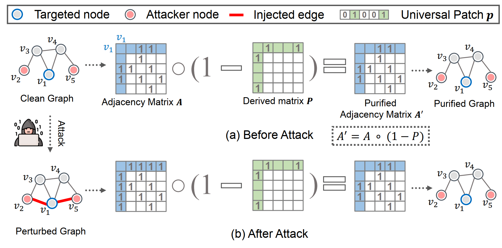

# GUARD: Graph Universal Adversarial Defense
PyTorch implementation of the CIKM 2023 paper: "GUARD: Graph Universal Adversarial Defense" [[arXiv]](https://arxiv.org/abs/2204.09803).


<p align="center">  <p align="center"><em>Fig. 1. An illustrative example of graph universal defense. The universal patch p can be applied to an arbitrary node (here v1) to protect it from adversarial targeted attacks by removing adversarial edges (if exist).</em></p>

# Requirements
+ torch==1.9
+ dgl==0.7.0

# Datasets
+ Cora (available in `data/`)
+ Pubmed (available in `data/`)
+ ogbn-arxiv from OGB
+ Reddit from http://snap.stanford.edu/graphsage/


Install graphattack:
```bash
cd GraphAttack
pip install -e .
```

# Quick Start
See `demo.ipynb`

# Reproduce results in the paper
run
```python

python evaluate_guard.py
```

# Cite
if you find this repo helpful, please cite our work:
```bixtex
@inproceedings{li2022guard,
  author       = {Jintang Li and
                  Jie Liao and
                  Ruofan Wu and
                  Liang Chen and
                  Zibin Zheng and
                  Jiawang Dan and
                  Changhua Meng and
                  Weiqiang Wang},
  title        = {{GUARD:} Graph Universal Adversarial Defense},
  booktitle    = {{CIKM}},
  pages        = {1198--1207},
  publisher    = {{ACM}},
  year         = {2023}
}
```
