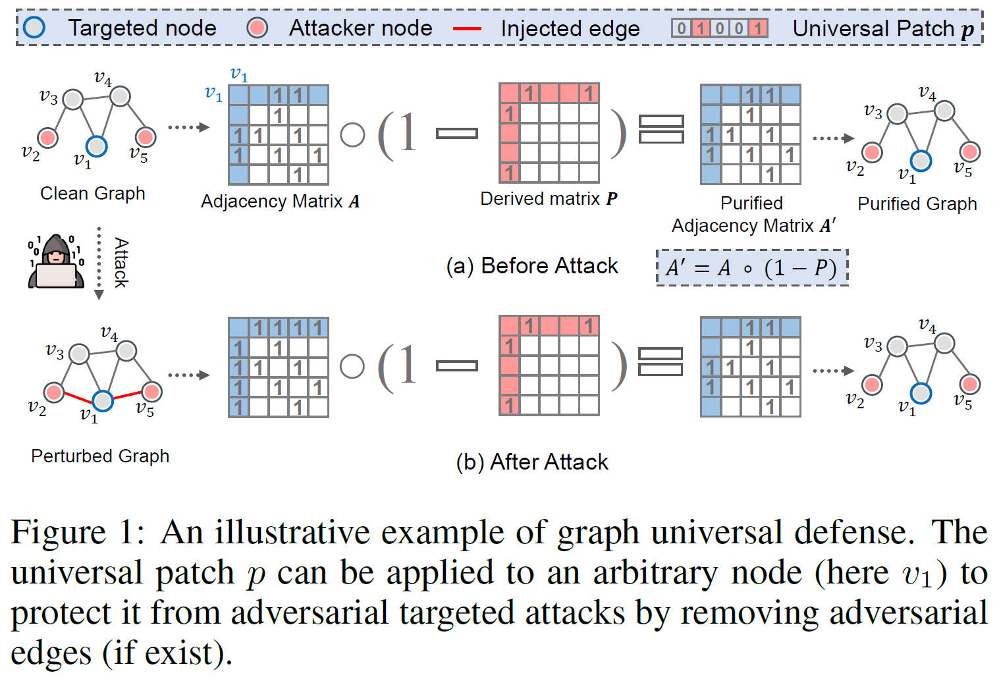

# GUARD: Graph Universal Adversarial Defense
PyTorch implementation of the paper "GUARD: Graph Universal Adversarial Defense" [[arXiv]](https://arxiv.org/abs/2204.09803).


<p align="center">  <p align="center"><em>Fig. 1. An illustrative example of graph universal defense. The universal patch p can be applied to an arbitrary node (here v1) to protect it from adversarial targeted attacks by removing adversarial edges (if exist).</em></p>

# Requirements
+ torch==1.9
- ogb == 1.3.3
- torch_sparse == 0.6.10
- torch_cluster == 1.5.9
- torch_geometric == 2.0.4
+ greatx

Install [greatx](https://github.com/EdisonLeeeee/GreatX):
```bash
git clone https://github.com/EdisonLeeeee/GreatX.git && cd GreatX
pip install -e .
```

# Quick Start
see `demo.ipynb`

# Reproduce results in our paper
run
```python

python evaluate_guard.py
```

# Cite
```bibtex
@article{li2022guard,
  title   = {GUARD: Graph Universal Adversarial Defense},
  author  = {Jintang Li and Jie Liao and Ruofan Wu and Liang Chen and Changhua Meng and Zibin Zheng and Weiqiang Wang},
  year    = {2022},
  journal = {arXiv preprint arXiv: Arxiv-2204.09803}
}
```
